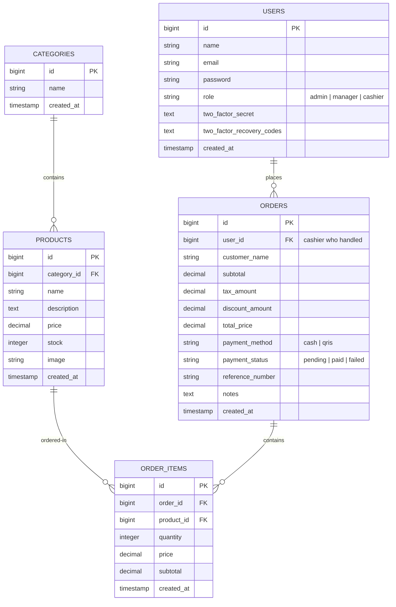
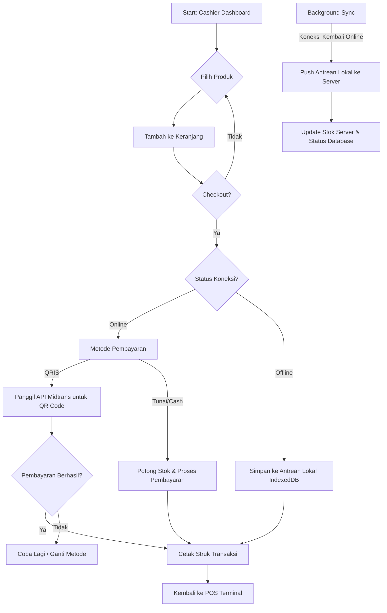
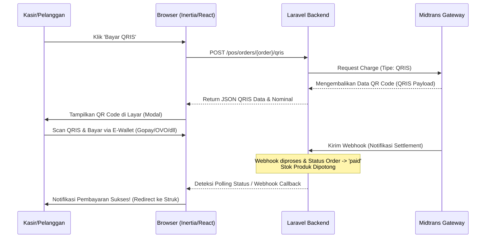

# ☕ POSO (Point of Sale)

[](https://laravel.com)
[](https://react.dev)
[](https://tailwindcss.com)
[](#)
[](LICENSE)

**POSO** adalah sistem Point of Sale (POS) berbasis web yang dirancang khusus untuk UMKM kedai kopi (coffee shop). Mengutamakan kecepatan, kemudahan penggunaan, keindahan antarmuka (premium UI/UX), dan keandalan tinggi melalui kemampuan **offline-first**. Aplikasi ini berjalan mulus baik dalam kondisi online maupun offline (tanpa koneksi internet) dan secara otomatis menyinkronkan data ketika koneksi terjalin kembali.

---

## 🌟 Fitur Utama

### 🛒 1. Terminal POS yang Responsif & Interaktif

- **Visual Grid Produk**: Grid produk yang dikelompokkan berdasarkan kategori secara dinamis untuk memudahkan akses cepat.
- **Pencarian Real-Time**: Pencarian produk instan tanpa hambatan saat pengetikan.
- **Keranjang Pintar (Cart)**: Tambah/hapus item, penyesuaian kuantitas, penerapan diskon, dan kalkulasi pajak (PPN 10%) otomatis secara lokal.

### 📶 2. Kemampuan Offline-First (PWA & IndexedDB)

- **Instalasi PWA (Progressive Web App)**: Dapat diinstal langsung di perangkat desktop maupun mobile layaknya aplikasi native.
- **Katalog Lokal (IndexedDB)**: Produk dan kategori disimpan secara lokal menggunakan database IndexedDB (melalui wrapper `idb`). Kasir tetap dapat mencari dan memilih produk meskipun jaringan mati.
- **Antrean Transaksi Offline**: Transaksi saat offline akan disimpan ke antrean lokal (IndexedDB) dan kasir tetap bisa melihat struk transaksi sementara.
- **Sinkronisasi Otomatis (Background Sync)**: Begitu mendeteksi koneksi internet kembali online, sistem secara otomatis mendorong (*push*) transaksi antrean lokal ke server pusat.

### 💳 3. Multi Metode Pembayaran & Integrasi QRIS

- **QRIS Dinamis**: Integrasi pembayaran nontunai QRIS real-time menggunakan **Midtrans Payment Gateway** (Core API). Dilengkapi dengan status polling otomatis dan penanganan webhook yang aman di sisi server.
- **Pembayaran Tunai (Cash)**: Pencatatan manual uang tunai dan kembalian, dengan pengurangan stok langsung begitu transaksi dibuat.
- **Manajemen Stok Fleksibel**: Pengurangan stok produk dilakukan secara instan untuk metode Cash, dan dilakukan pasca pembayaran sukses (*settlement*) untuk metode QRIS.

### 📊 4. Panel Manajemen & Analitik (Admin & Manager)

- **Dashboard Interaktif**: Visualisasi data penjualan harian/bulanan, performa produk terlaris, dan analitik pendapatan.
- **CRUD Manajemen Produk & Kategori**: Kelola data menu kopi, deskripsi, harga, stok, dan gambar dengan mudah.
- **Manajemen Pengguna & Hak Akses (RBAC)**: Pengaturan akun staf dengan peran masing-masing (Admin, Manager, Cashier).
- **Laporan Keuangan Ekspor**: Unduh laporan transaksi penjualan dalam format PDF atau Excel.

### 🔐 5. Keamanan & Konfigurasi Lanjut (Fortify)

- **Autentikasi Headless**: Menggunakan Laravel Fortify untuk manajemen otentikasi yang kokoh.
- **Autentikasi Dua Faktor (2FA/TOTP)**: Dukungan penuh keamanan tambahan menggunakan aplikasi autentikator (Google Authenticator, dsb) lengkap dengan kode pemulihan (*recovery codes*).
- **Manajemen Profil & Password**: Pengaturan profil mandiri untuk setiap staf, pengaturan tema (Light/Dark/System), dan reset password yang aman.

---

## 🛠️ Tech Stack & Spesifikasi

Sistem ini dibangun di atas tumpukan teknologi modern berikut:

- **Backend Framework**: [Laravel 13.x](https://laravel.com) (dengan PHP 8.3+)
- **Frontend Framework**: [React 19.x](https://react.dev) + [Inertia.js v2](https://inertiajs.com) (Single Page Application tanpa kompleksitas API terpisah)
- **Styling**: [Tailwind CSS v4.0](https://tailwindcss.com) (menggunakan compiler bawaan Vite yang sangat cepat) + [shadcn/ui](https://ui.shadcn.com) & Radix Primitives
- **Client Database**: [IndexedDB Wrapper (`idb`)](https://github.com/jakearchibald/idb) untuk penyimpanan data offline
- **Build Tool**: [Vite 7.0](https://vite.dev) + [Vite PWA Plugin](https://vite-pwa-org.netlify.app/)
- **Routing Generator**: [Laravel Wayfinder](https://github.com/laravel/wayfinder) (pemetaan rute Laravel ke fungsi TypeScript secara otomatis)
- **Payment Gateway**: [Midtrans SDK PHP](https://github.com/Midtrans/midtrans-php) (Core API integration)
- **Testing Framework**: [Pest PHP 4.x](https://pestphp.com) + PHPUnit 12.x
- **Linter & Formatter**: [Laravel Pint](https://laravel.com/docs/pint) (PHP) & [Prettier](https://prettier.io) + [ESLint](https://eslint.org) (JS/TS)

---

## 👥 Hak Akses & Peran Staf (RBAC)

Aplikasi memiliki 3 level hak akses utama yang disesuaikan dengan alur operasional coffee shop:

| Fitur / Halaman             | Admin | Manager | Cashier |
|:--------------------------- |:-----:|:-------:|:-------:|
| **Terminal POS**            | ✅     | ✅       | ✅       |
| **Dashboard Utama**         | ✅     | ✅       | ❌       |
| **Laporan Penjualan**       | ✅     | ✅       | ❌       |
| **CRUD Produk & Kategori**  | ✅     | ✅       | ❌       |
| **CRUD Staf (User)**        | ✅     | ❌       | ❌       |
| **Pengaturan Toko**         | ✅     | ❌       | ❌       |
| **Settings (Profil & 2FA)** | ✅     | ✅       | ✅       |

---

## 🗄️ Skema Database Utama

Berikut adalah tabel-tabel utama yang merepresentasikan arsitektur data sistem ini:



---

## 🚀 Langkah Instalasi & Setup Lokal

Ikuti langkah-langkah di bawah ini untuk menjalankan aplikasi di lingkungan pengembangan lokal Anda:

### 📋 Prasyarat Sistem

Pastikan perangkat Anda telah terinstal software berikut:

- **PHP >= 8.3** (dengan ekstensi `pdo`, `mbstring`, `openssl`, `xml`, `zip`, `gd`, `sqlite`)
- **Composer** (Dependency manager PHP)
- **Node.js >= 20.x** & **npm** (Package manager Javascript)
- **Database** (SQLite bawaan, atau Anda bisa menggunakan MySQL/PostgreSQL)

### ⚙️ Proses Instalasi

1. **Clone Repositori**
   
   ```bash
   git clone https://github.com/username/point-of-sales.git
   cd point-of-sales
   ```

2. **Jalankan Setup Script (Otomatis)**
   Proyek ini menyediakan perintah setup terintegrasi di `composer.json` yang akan menginstal dependensi PHP/JS, menyalin konfigurasi env, membuat database SQLite default, melakukan migrasi, dan mem-build asset frontend:
   
   ```bash
   composer run setup
   ```
   
   *Atau jika Anda ingin menjalankannya secara manual satu per satu:*
   
   ```bash
   # 1. Instal dependensi PHP
   composer install
   
   # 2. Salin environment file
   cp .env.example .env
   
   # 3. Generate Application Key
   php artisan key:generate
   
   # 4. Buat Database SQLite kosong (jika menggunakan SQLite)
   touch database/database.sqlite
   
   # 5. Jalankan migrasi dan seeder
   php artisan migrate --seed
   
   # 6. Instal dependensi JS & build
   npm install
   npm run build
   ```

3. **Konfigurasi Lingkungan (`.env`)**
   Sesuaikan konfigurasi database Anda. Jika menggunakan SQLite (default), pastikan konfigurasinya mengarah seperti berikut:
   
   ```env
   DB_CONNECTION=sqlite
   DB_DATABASE=/absolute/path/to/database/database.sqlite
   ```
   
   *(Ganti dengan path absolut file `database.sqlite` Anda)*

4. **Konfigurasi Midtrans (Opsional untuk Fitur QRIS)**
   Dapatkan Server Key dan Client Key Anda di portal [Midtrans Sandbox](https://dashboard.sandbox.midtrans.com/), lalu tambahkan ke file `.env`:
   
   ```env
   MIDTRANS_MERCHANT_ID=your_merchant_id
   MIDTRANS_SERVER_KEY=your_server_key
   MIDTRANS_CLIENT_KEY=your_client_key
   MIDTRANS_IS_PRODUCTION=false
   ```

---

## 🖥️ Menjalankan Aplikasi di Lingkungan Development

Proyek ini telah dikonfigurasi dengan utilitas `concurrently` di dalam `composer.json` untuk mempermudah eksekusi lingkungan pengembangan. Cukup jalankan satu perintah berikut:

```bash
composer run dev
```

Perintah di atas secara bersamaan akan mengaktifkan:

- 💻 **Laravel Serve**: Menjalankan server aplikasi di `http://127.0.0.1:8000`
- ⚙️ **Queue Listener**: Mendengarkan antrean background job untuk pengiriman data / sinkronisasi.
- 🗂️ **Vite Dev Server**: Melakukan kompilasi asset frontend React secara instan (hot-reload).
- 📜 **Laravel Pail**: Perekam log interaktif langsung di terminal.

> **Tips:** Apabila Anda ingin menggunakan rendering di sisi server (SSR) untuk performa muat halaman awal yang maksimal, jalankan:
> 
> ```bash
> composer run dev:ssr
> ```

### 🔑 Akun Default untuk Login (Demo Data)

Setelah melakukan seeding database (`php artisan migrate --seed`), gunakan kredensial berikut untuk masuk ke sistem:

- **Admin (Akses Penuh):**
  - **Email:** `posoadmin@poso.com`
  - **Password:** `password`
- **Manager (Stok & Laporan):**
  - **Email:** `posomanager@poso.com`
  - **Password:** `password`
- **Cashier (Kasir Terminal):**
  - **Email:** `posokasir@poso.com`
  - **Password:** `password`

---

## 🔄 Alur Kerja Sistem (System Flows)

Berikut adalah visualisasi alur utama yang diimplementasikan di aplikasi POSO:

### 1. Transaksi Kasir (Online vs Offline)



### 2. Integrasi Siklus Pembayaran QRIS Midtrans



---

## 🧪 Pengujian (Testing)

Aplikasi ini memiliki cakupan pengujian yang komprehensif menggunakan **Pest PHP 4**. Pengujian mencakup alur kasir, webhook pembayaran, dashboard analytics, dan otentikasi.

Untuk menjalankan suite pengujian, jalankan perintah berikut:

```bash
composer run test
```

*Atau secara manual:*

```bash
php artisan test
```

Jika Anda ingin menjalankan pengujian dengan visualisasi cakupan kode (coverage) atau menyaring tes tertentu:

```bash
# Menjalankan pengujian spesifik
php artisan test --filter=OrderTest

# Menjalankan tes dalam mode compact
php artisan test --compact
```

---

## 🧹 Pemeliharaan & Format Kode

Untuk memastikan kualitas kode tetap terjaga dan konsisten dengan standar tim pengembang Laravel, jalankan perintah berikut sebelum membuat commit:

1. **Format Kode PHP (Laravel Pint):**
   
   ```bash
   composer run lint
   ```

2. **Format Asset Frontend (Prettier & ESLint):**
   
   ```bash
   # Memeriksa format file
   npm run lint:check
   
   # Memperbaiki masalah format otomatis
   npm run lint
   npm run format
   ```

---

## 📂 Struktur Direktori Utama

- `app/Http/Controllers/` - Logika utama aplikasi (POS, Laporan, Pembayaran/Midtrans, dll.).
- `app/Models/` - Model Eloquent ORM (User, Product, Category, Order, OrderItem).
- `bootstrap/app.php` - Registrasi middleware & routing deklaratif Laravel 13.
- `config/services.php` - Konfigurasi API Kredensial Midtrans.
- `database/migrations/` - Struktur skema database relasional.
- `database/seeders/` - Seeder data demo produk, kategori, dan akun kasir/admin.
- `resources/js/` - Seluruh komponen React 19, Hooks, Layouts, dan Pages.
  - `resources/js/pages/POS/Terminal.tsx` - Halaman Terminal Kasir POS (Fitur utama).
  - `resources/js/lib/db.ts` - Konfigurasi & Helper database lokal IndexedDB (idb).
  - `resources/js/components/ui/` - Komponen desain shadcn/ui.
- `routes/web.php` - Peta rute web aplikasi dan otentikasi.
- `vite.config.ts` - Konfigurasi bundle Vite, PWA caching, dan plugin Wayfinder.

---

## 📄 Lisensi

Proyek ini didistribusikan di bawah lisensi **MIT**. Anda bebas untuk menggunakan, memodifikasi, dan menyebarkannya untuk keperluan UMKM maupun pembelajaran pribadi.
