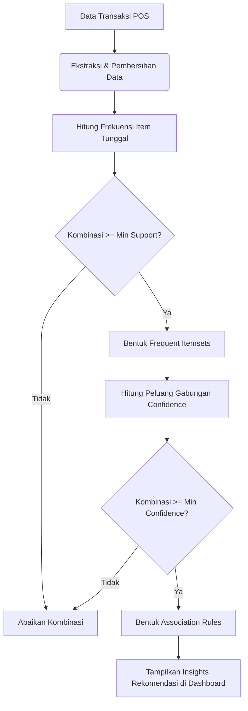
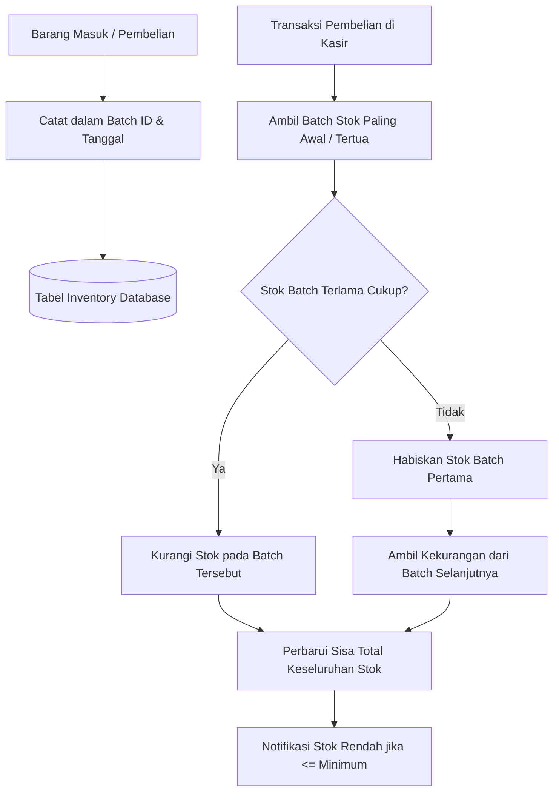

# Cara Kerja Algoritma pada Sistem POS

Dokumen ini menjelaskan alur kerja algoritma yang diterapkan pada Sistem Point of Sales (POS). Dalam konteks pengembangan sistem POS modern, tedapat dua algoritma utama yang diterapkan: **Apriori** untuk analisis data keranjang belanja (AI Analytics) dan **FIFO (First-In, First-Out)** untuk manajemen inventaris.

---

## 1. Algoritma Apriori (Market Basket Analysis)

Algoritma Apriori digunakan pada sisi AI Analytics Dashboard untuk menemukan hubungan (association rules) antar produk dari data transaksi pelanggan. Hasil dari algoritma ini digunakan untuk strategi _bundling_ produk, penempatan barang, atau rekomendasi otomatis.

### Cara Kerja:
1. **Pengumpulan Data:** Sistem menarik seluruh riwayat item dari tabel transaksi yang berhasil diselesaikan.
2. **Kalkulasi Support:** Sistem menghitung seberapa sering kombinasi item muncul secara bersamaan dibandingkan dengan total transaksi. Kombinasi yang melewati batas _Minimum Support_ akan dipertahankan.
3. **Kalkulasi Confidence:** Sistem menganalisis seberapa kuat probabilitas item B dibeli jika item A dibeli. Kombinasi yang melewati batas _Minimum Confidence_ akan dibentuk menjadi aturan (rule).
4. **Output:** Aplikasi menampilkan aturan tersebut di Dashboard berupa wawasan visualisasi / rekomendasi produk.

### Diagram Alir (Mermaid)

---

## 2. Algoritma FIFO (First-In, First-Out) Manajemen Inventaris

Algoritma FIFO diterapkan dalam modul manajemen stok atau inventaris. Pada bisnis ritel seperti F&B (contoh: kafe), bahan baku yang masuk lebih dulu harus digunakan atau dijual lebih awal agar tidak melewati masa kedaluwarsa.

### Cara Kerja:
1. **Catat Barang Masuk:** Saat admin atau gudang menambahkan stok baru, sistem menyimpannya ke dalam _batch_ kedatangan lengkap dengan _timestamp_.
2. **Pengurangan Stok:** Saat pesanan baru masuk dari kasir as POS, sistem melakukan iterasi terhadap stok barang.
3. **Penyusutan per Batch:** Sistem akan mengurangi stok dari _batch_ dengan tanggal yang terlama terlebih dahulu.
4. **Sisa Stok:** Jika _batch_ tertua habis namun pengurangan stok belum terpenuhi, sistem akan beralih ke _batch_ termuda di urutan selanjutnya hingga kuantitas yang dibutuhkan terpenuhi.

### Diagram Alir (Mermaid)

---

## Kesimpulan

Integrasi **Apriori** memberikan nilai tambah (*value-add*) dengan merubah data transaksi pasif menjadi wawasan bisnis prediktif. Sementara **FIFO** memastikan operasional logistik di sistem POS ini efisien dan meminimalkan kerugian (bahan baku rusak). Keduanya diproses di _backend_ (Laravel controller/services) sebelum datanya dikonsumsi ke _frontend_ antarmuka React.
