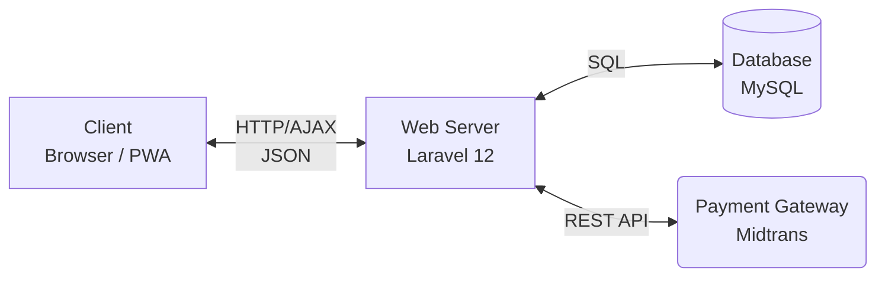
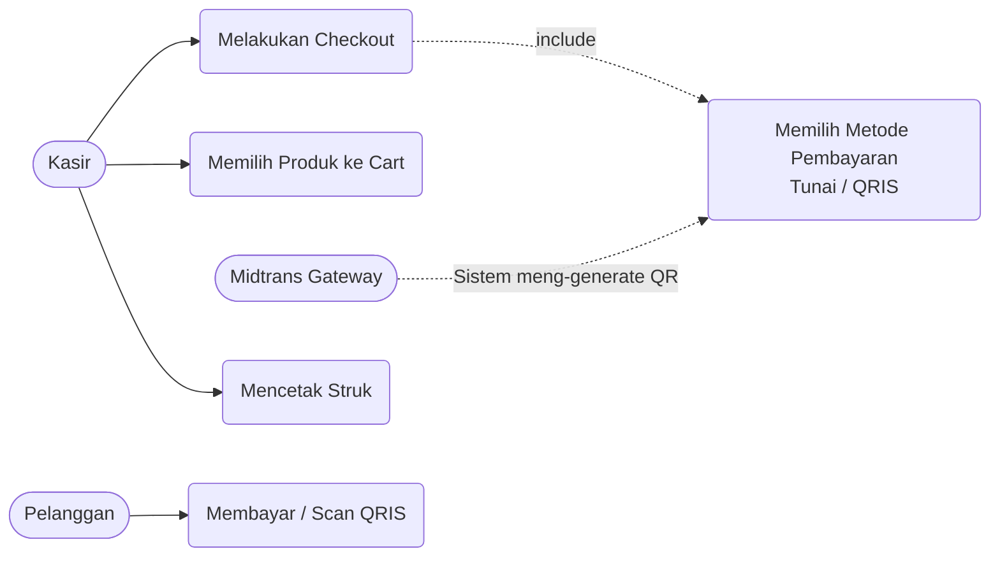
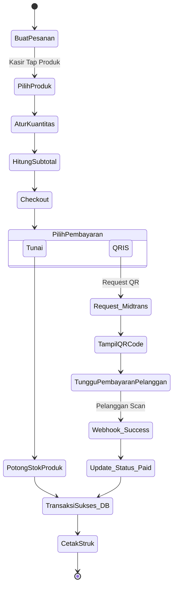
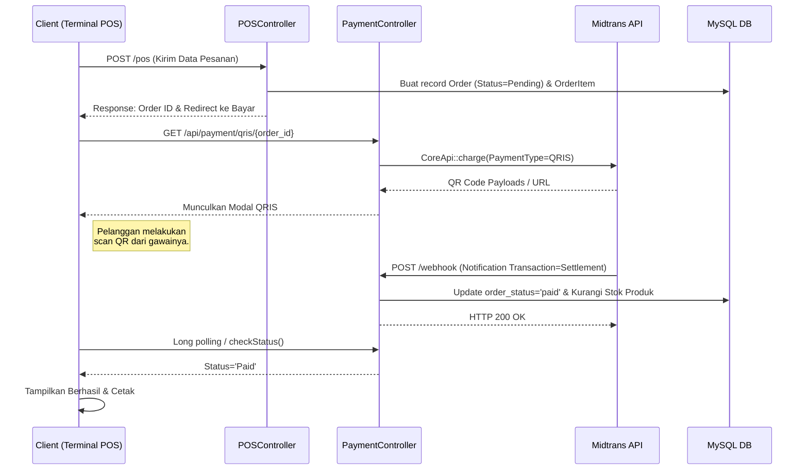
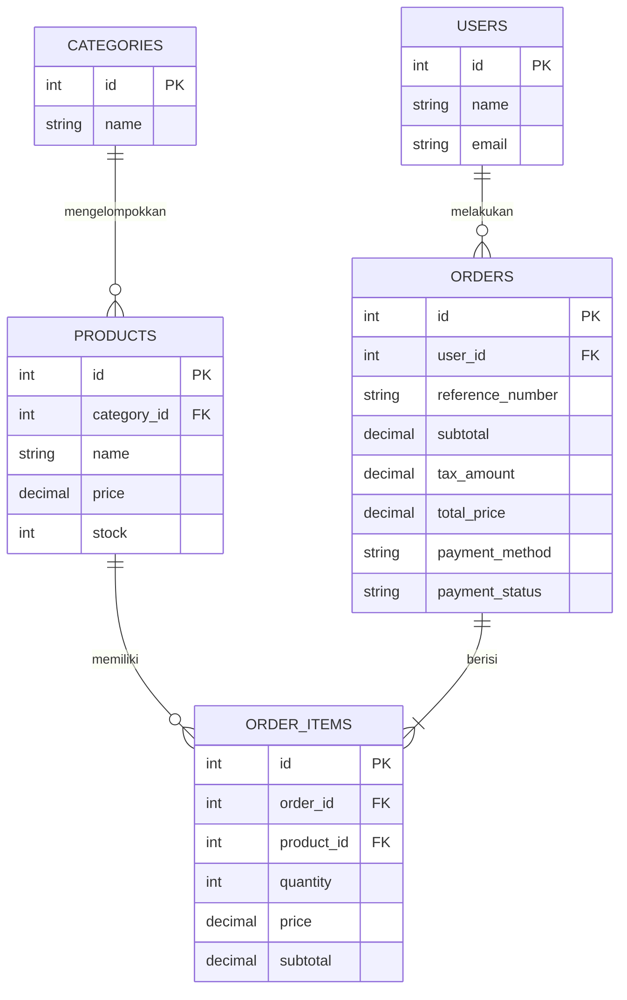

# Perancangan Sistem: Proses Transaksi POS (Kopi Turu)

Dokumen ini merinci perancangan sistem backend dan logika transaksi (pembelian) pada aplikasi Kopi Turu POS.

---

## 1. Arsitektur Aplikasi (System Architecture)

Struktur aplikasi menggunakan pola *Client-Server* dengan dukungan *Progressive Web App* (PWA) di sisi klien.

### Diagram Arsitektur


### Tech Stack & Alasan Memilih
* **Frontend**: React (v19) dipadukan dengan Inertia.js (v2).
  *Alasan*: Memberikan pengalaman pengguna yang sangat halus (mirip *Single Page Application* murni) tanpa kerumitan membangun REST API untuk *routing* halaman. Sangat responsif untuk aplikasi mesin kasir yang dituntut cepat.
* **Backend**: PHP (v8.3) dengan Framework Laravel 12.
  *Alasan*: Laravel memiliki ekosistem bawaan yang matang; dari Object Relational Mapping (Eloquent), proteksi injeksi SQL, validasi *Form Request*, hingga kemudahan membuat *REST API* atau penerima *Webhook* (contoh: notifikasi Midtrans).
* **Database**: MySQL.
  *Alasan*: Struktur relasional sangat ideal untuk menjaga keutuhan data transaksi E-Commerce / POS (misal, keterkaitan pesanan dengan detail dan produk).

---

## 2. Perancangan Proses (Diagram Logika)

### a. Use Case Diagram
Menjelaskan hak akses aktor dalam proses transaksi:



### b. Activity Diagram (Alur Pembelian)
Menggambarkan langkah-langkah kasir sejak memasukkan pesanan hingga struk cetak.



### c. Sequence Diagram (Integrasi Pembayaran QRIS)
Sangat berguna untuk menjelaskan interaksi dari antarmuka POS menuju *Server* dan *Gateway Midtrans*.



---

## 3. Perancangan Basis Data (Database Design)

### a. ERD (Entity Relationship Diagram)
Skema relasional inti untuk transaksi E-Commerce / POS.



### b. Kamus Data (Spesifikasi Tabel POS / Transaksi)

1. **`products`**: Menyimpan master data barang.
   - `id` (int, PK, AI)
   - `category_id` (int, FK) -> Rujukan jenis minuman/makanan.
   - `name` (varchar 255) -> Nama menu.
   - `price` (decimal 15,2) -> Harga jual.
   - `stock` (int) -> Jumlah fisik bahan atau *inventory*.
2. **`orders`**: Memegang catatan kepala transaksi pembelian.
   - `id` (int, PK)
   - `user_id` (int, FK) -> Siapa kasir yang memproses.
   - `reference_number` (varchar 50) -> Kode struk (misal: POS-20240316-AF).
   - `discount_amount` (decimal) -> Rincian diskon.
   - `tax_amount` (decimal) -> Rincian PPN 10%.
   - `total_price` (decimal) -> Uang mutlak yang dibayar final.
   - `payment_method` (varchar) -> 'cash' | 'qris'.
   - `payment_status` (varchar) -> 'pending' | 'paid' | 'failed'.
3. **`order_items`**: Menyimpan jejak mutasi menu yang diisi di nota.
   - `id` (int PK)
   - `order_id` (int, FK)
   - `product_id` (int, FK)
   - `quantity` (int) -> Jumlah dipesan.
   - `price` (decimal) -> Harga per tangkap saat transaksi itu terjadi.
   - `subtotal` (decimal) -> `quantity` * `price`.

---

## 4. Perancangan Antarmuka (Interface Design)

### a. Sitemap Jalur Kasir
Root `.` -> `[Layar Terminal POS (Pilih Produk & Cart)]` -> `[Tinjauan Keranjang (Pop up / Sidebar)]` -> `[Pemilihan Metode Bayar]` -> `[Layar Transaksi Sukses & Print]`.

### b. Wireframe Terminal POS
Sistem POS ini menggunakan *layout* modern layar besar:
- **Bagian Kiri (30% layar)**: Keranjang Belanja (*Cart*). Memuat list ringkas barang, input *touch/click* untuk *(+)* / *(-)* buah pesanan. Bagian bawahnya memuat rincian total dan tombol besar **Process/Pay**.
- **Bagian Kanan (70% layar)**: *Visual Grid* kumpulan menu/kategori. Tombol besar mempermudah kasir menekan produk yang dibeli pelanggan (misal: grid untuk Kopi Susu, grid untuk Donat).

---

## 5. Perancangan Algoritma & Keamanan

### a. Algoritma (Kalkulasi Transaksi Keuangan)
Backend dieksekusi secara ketat untuk mencegah manipulasi data harga dari *klien frontend*.
```php
// Simulasi Algoritma Dasar (Kalkulasi Server-Side):
$totalPrice = 0;
foreach ($items as $item) {
   $productDB = Product::find($item['product_id']);
   // Kalkulasi harus dari harga database, tidak dari request frontend
   $subtotalPerBarang = $productDB->price * $item['quantity'];
   $totalPrice += $subtotalPerBarang;
}

$discount = $request['discount_amount'] ?: 0;
$tax = ($totalPrice - $discount) * 0.10; // Perhitungan PPN Otomatis 10%
$final_total = $totalPrice - $discount + $tax;
```

### b. Keamanan (Security)
1. **Password Authentication**: Password seluruh staf restoran dan admin menggunakan `Bcrypt` *(Hash::make)* milik Laravel.
2. **Validasi Persediaan (Stock Concurrency Check)**: Sebelum memotong *"Saldo Stok/Inventory"*, sistem (pada `POSController`) mengecek apakah di backend persediaan masih ada, jika ada pengurangan serentak dari kasir lain, akan dipatahkan dengan pesan "*Insufficient stock for product*".
3. **Validasi Callback Midtrans**: 
   - Notifikasi status `capture/settlement` dari Midtrans diterima lewat rute `/webhook`. 
   - Midtrans mengirim *signature* (kunci rahasia dari `.env`) ke server. Ini mencegah pihak merugikan pura-pura mengirim webhook *"Telah Dibayar"* supaya stok keluar barang gratisan. Server Key dijaga ketat di `config('services.midtrans')`. 
   - Laravel juga menggunakan *Rate Limiting* (`throttle:api`) untuk menghentikan serangan spam request.
