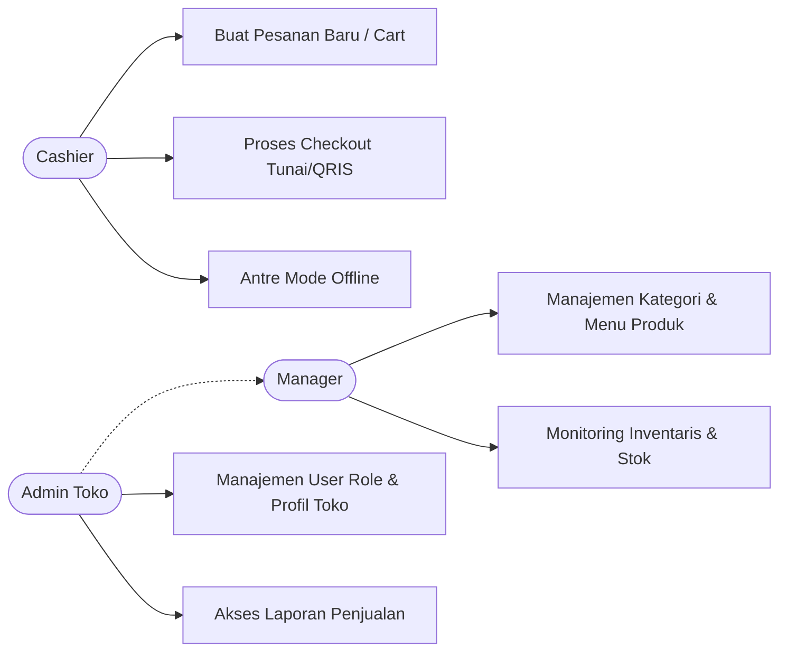
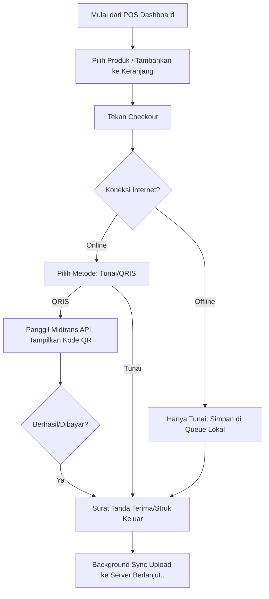

# Proposal Proyek: Kopi Turu POS

## 1. Judul & Identitas Proyek

- **Nama Project**: Kopi Turu POS
- **Tagline**: "Sistem Kasir *Offline-First* yang Cepat, Ringan, dan Tangguh untuk UMKM Kedai Kopi."
- **Tim Proyek**: 
  - Alysiya Ramadhani (231240001453)
  - Dany Akmallun Ni'am (231240001460)
  - M. Adimas Satria S (231240001465)
  - Irfan Fadhila Akbar (231240001468)

## 2. Pendahuluan (Latar Belakang)

- **Kondisi Saat Ini**: Tren kedai kopi skala UMKM terus menjamur, namun masih banyak yang menggunakan pencatatan manual atau mesin kasir tablet tradisional. Banyak sistem POS *(Point of Sales)* modern berbasis *cloud* yang ada di pasaran sangat bergantung pada koneksi internet, sehingga sering merepotkan saat terjadi gangguan jaringan di lokasi kedai.
- **Masalah (Problem Statement)**: UMKM pengelola kedai kopi kesulitan menemukan sistem POS yang ramah kantong, ringan, namun tetap dapat beroperasi secara penuh ketika koneksi internet tidak stabil atau terputus sama sekali (terutama saat jam sibuk). 
- **Solusi**: **Kopi Turu POS** hadir sebagai solusi sistem POS berbasis *Progressive Web App* (PWA) dengan arsitektur *Offline-First*. Aplikasi ini memungkinkan kasir tetap memproses pesanan dan melayani pelanggan secara penuh tanpa jaringan, dan akan mensinkronisasikan data transaksi secara *background* ke peladen (server) begitu internet kembali stabil.

## 3. Analisis Bisnis

- **Model Bisnis**: **B2B (Business-to-Business)**. Aplikasi ini ditujukan untuk digunakan oleh pemilik bisnis kedai kopi *(merchant)* sebagai penunjang utama operasional mereka.
- **Target Pasar (User Persona)**: Pemilik atau pengelola kedai kopi (UMKM) berusia 20-45 tahun; menginginkan kemudahan transisi dari catatan kertas ke sistem digital berdesain modern namun tanpa proses belajar yang sulit.
- **Analisis Kompetitor**: Dibandingkan dengan POS raksasa (seperti Moka atau Pawoon), Brew & Bytes menawarkan platform lebih *lightweight* dengan fungsi spesifik untuk kedai kopi. Keunggulan utamanya ada pada respon real-time berkat React dan ketangguhan offline menggunakan IndexedDB.
- **Analisis SWOT**:
  - **Strength**: Kapabilitas *offline-first* PWA, sangat ringan, UI responsif dan premium, mendukung pembayaran QRIS dinamis Midtrans.
  - **Weakness**: Belum dilengkapi fitur laporan akuntansi atau stok bahan setengah jadi yang super kompleks untuk tahap awal.
  - **Opportunity**: Peningkatan adopsi solusi digital dan nontunai di UMKM lapis menengah yang membutuhkan sistem stabil.
  - **Threat**: Potensi persaingan langsung dengan aplikasi kasir murah berbasis mobile Android.

## 4. Spesifikasi Produk & Fitur

Berikut adalah System Requirements Specification (SRS) ringkas:

- **Fitur Pengunjung / Terminal Cashier**:
  - Tampilan grid *(Visual Grid)* produk per kategori untuk kecepatan pemilihan.
  - Pencarian fitur instan *(real-time search)* pesanan.
  - Cart management (tambah/kurang produk, pengaturan jumlah).
  - Integrasi proses Checkout multi-metode (Pembayaran Tunai dan scan-to-pay QRIS dinamis).
  - Cetak struk/tampilan tanda terima.
- **Fitur Kestabilan Offline**:
  - Dapat diinstall tanpa koneksi melalui *browser* (PWA).
  - Data katalog disimpan via **IndexedDB** lokal.
  - Sinkronisasi transaksi *background* secara mandiri ke *server* saat alat online kembali.
- **Fitur Admin & Manajemen**:
  - Dashboard eksekutif: meninjau penjualan harian dan stok.
  - Manajemen Katalog: CRUD (Create, Read, Update, Delete) Produk dan Menu Kategori beserta gambar secara mudah.
  - Manajemen Stok: Pemotongan bahan otomatis dan *update* stok manual.
  - Manajemen Tim: Sistem otorisasi (*Role*: Admin, Manager, Cashier).

## 5. Perancangan Sistem

- **Tech Stack**: 
  - **Backend**: Laravel 12 (PHP)
  - **Frontend**: Inertia.js v2 dengan React v19
  - **Styling UI**: Tailwind CSS v4
  - **Database & Lokal Data**: MySQL (Server Cloud) dan IndexedDB / Web Storage (Lokal Klien).
  - **Integrasi Webhook**: API Midtrans Payment Gateway PHP
- **Use Case Diagram**:

- **Flowchart Alur Transaksi**:

- **Sitemap**:
  - Beranda Utama / Login
  - POS Terminal Kasir
    - Keranjang
    - Pembayaran Final
  - Admin Papan Kendali (Dashboard)
    - Master Katalog Produk & Kategori
    - Laporan Penjualan *(Analytics)*
    - Pengaturan Pos & *Roles User*

## 6. Rencana Pengerjaan (Timeline)

Sesuai rancangan *Gantt Chart* atau tabel rentang waktu sederhana:

| Minggu Berjalan | Target Resolusi Pekerjaan (Milestone) |
| :--- | :--- |
| **Minggu 1** | Analisis kebutuhan, perumusan UI/UX desain, finalisasi format Database. |
| **Minggu 2** | Persiapan server Laravel 12, PWA config lokal, Sistem Model Database. |
| **Minggu 3** | Koding Visual UI Panel POS Kasir dan Dashboard dengan Inertia/React+Tailwind. |
| **Minggu 4** | Implementasi sistem sinkronisasi IndexedDB, *Cart Store Management*. |
| **Minggu 5** | Interkoneksi API Midtrans Webhook, uji coba transaksi, dan *bug fixing*. |
| **Minggu 6** | Penyempurnaan (*Testing Pest*), pengunduhan ke server Cloud (*Deploy*), dan Dokumentasi. |

## 7. Metodologi Pengembangan

Sistem dikembangkan menggunakan model gabungan **Incremental Waterfall** dan **Agile (Kanban)**:

- **Incremental Waterfall**: Digunakan sebagai acuan *milestone* skala besar (*macro-management*) mingguan seperti diagram alur pengerjaan di atas. Proyek memiliki dokumen persyaratan spesifikasi akhir (SRS) yang sudah mutlak (*fixed*), sehingga tahapan perancangan antarmuka, *coding*, pengujian, hingga penyebaran sistem (*deploy*) dapat dikawal serah terima sesuai target utuh 6 minggu.
- **Agile (Kanban)**: Digunakan untuk memanajemen operasional dan kolaborasi harian tim (*micro-management*). Karena dikembangkan paralel oleh 4 orang perancang, seluruh tugas teknis dipisah ke dalam kartu tugas papan kendali iteratif (*Kanban Board*: *To Do*, *Doing*, *Done*). Ini memastikan komunikasi kerja di *repository* Laravel/React ini terkontrol efisien tanpa memicu *code conflict* dan tidak kaku menunggu rekan setimnya selesai.

## 8. Penerapan Algoritma Sistem

Guna memberikan kecerdasan dan tingkat efisiensi komputasi yang baik, sistem mengimplementasikan dua algoritma krusial pada dua modul yang berbeda:

### A. Algoritma FIFO (*First-In, First-Out*)
**Modul Tujuan**: Manajemen Inventaris & Pemotongan Stok
- **Konsep**: Metode antrean data di mana barang/bahan yang pertama kali masuk (dicatat dalam gudang aplikasi) merupakan barang yang harus dikeluarkan (terjual) lebih dulu. Hal ini sangat penting bagi industri F&B (kedai kopi) demi menjaga masa kedaluwarsa barang (*Quality Control*).
- **Implementasi**: Saat kasir memproses pesanan di terminal POS, sistem pelacakan *batch* persediaan di level basis data akan bergerak mencari *ID masuk stok* paling tua untuk sebuah produk, lalu memotong saldo (kuantitas) miliknya lebih dulu. Jika stok pada kumpulan terlama habis terpotong, sistem melanjutkan sisa potongannya ke himpunan stok baru (*next oldest batch*).

### B. Algoritma Apriori (*Market Basket Analysis*)
**Modul Tujuan**: Analitik Laporan (*Dashboard Admin*) / *Data Mining*
- **Konsep**: Algoritma ekstraksi aturan asosiasi (*Association Rule Learning*) untuk menemukan pola frequent itemset dari sekumpulan data transaksi. Tujuannya adalah mencari tahu produk-produk apa saja yang sering dibeli secara bersamaan oleh pelanggan.
- **Implementasi**: Melalui pelacakan data pada jutaan baris tabel `order_items`, rutin Apriori menghitung nilai *Support* (frekuensi munculnya kombinasi produk) dan *Confidence* (kepastian kombinasi). Contoh: Analisis *engine* dapat menyimpulkan bahwa *"Jika pembeli memesan Americano, 75% kemungkinan ia juga membeli Donat Kentang"*. Hasil analitik (berbentuk rekomendasi kombinasi bundle) ini akan ditayangkan secara grafis di panel laporan pimpinan untuk dipakai merumuskan strategi penempatan produk, penawaran diskon, maupun promo paket hemat (*bundling*).
