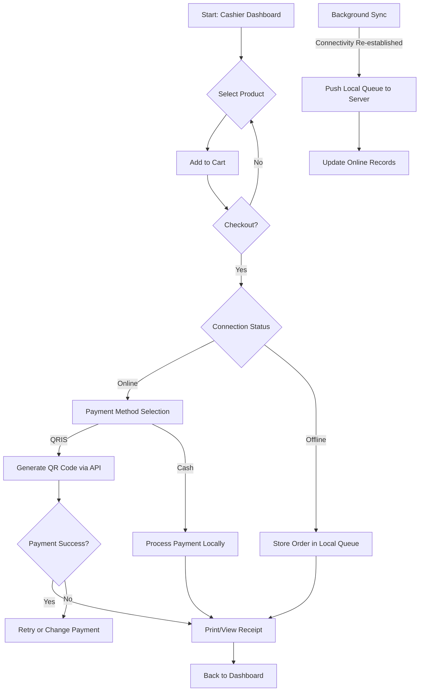
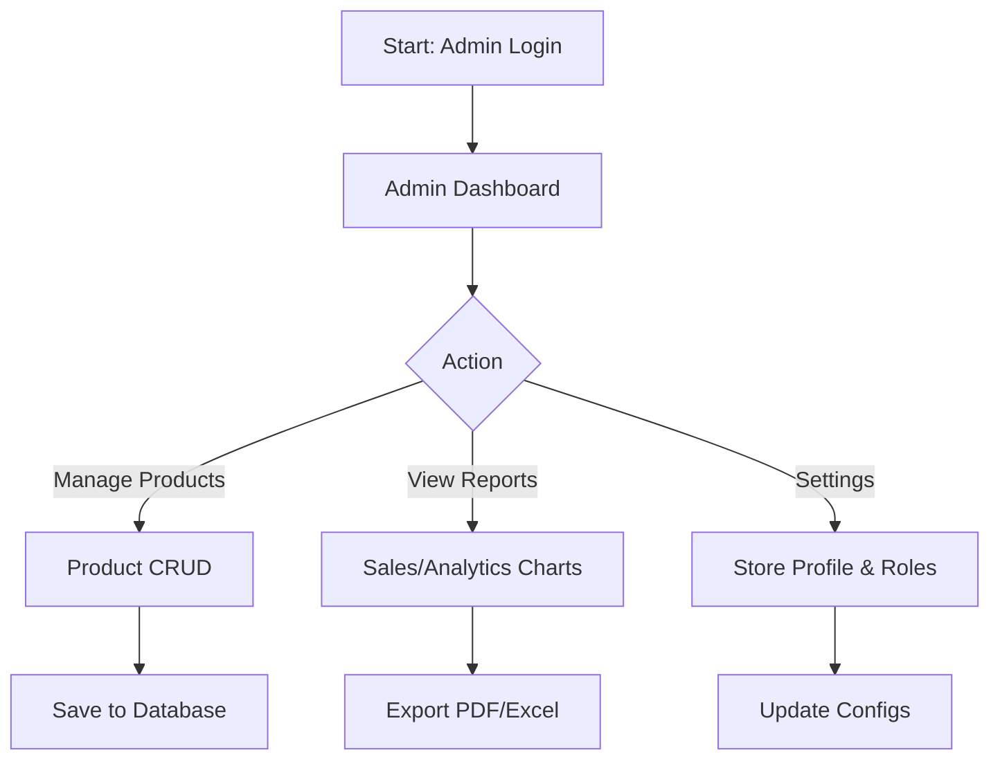
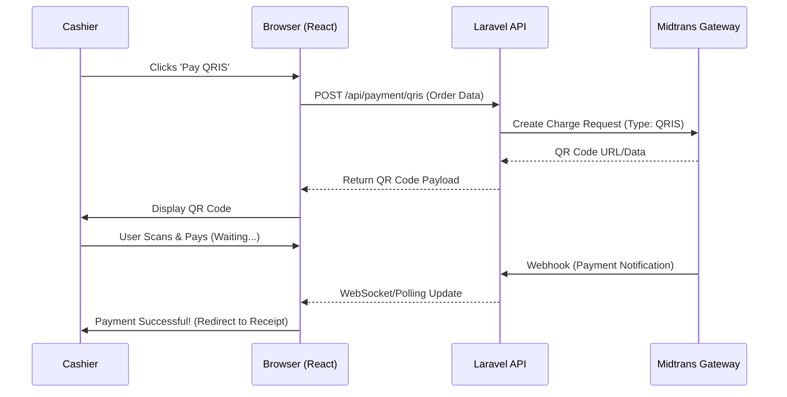

# User Flow: Brew & Bytes POS

## 1. Cashier Operation Flow (Online/Offline)

```mermaid
graph TD
    A[Start: Cashier Dashboard] --> B{Select Product}
    B --> C[Add to Cart]
    C --> D{Checkout?}
    D -- No --> B
    D -- Yes --> E{Connection Status}
    
    E -- Online --> F[Payment Method Selection]
    E -- Offline --> G[Store Order in Local Queue]
    
    F -- QRIS --> H[Generate QR Code via API]
    F -- Cash --> I[Process Payment Locally]
    
    H --> J{Payment Success?}
    J -- Yes --> K[Print/View Receipt]
    J -- No --> L[Retry or Change Payment]
    
    I --> K
    G --> K
    K --> M[Back to Dashboard]
    
    N[Background Sync] -- Connectivity Re-established --> O[Push Local Queue to Server]
    O --> P[Update Online Records]
```

## 2. Administrator/Manager Flow

```mermaid
graph TD
    A[Start: Admin Login] --> B[Admin Dashboard]
    B --> C{Action}
    
    C -- Manage Products --> D[Product CRUD]
    C -- View Reports --> E[Sales/Analytics Charts]
    C -- Settings --> F[Store Profile & Roles]
    
    D --> G[Save to Database]
    E --> H[Export PDF/Excel]
    F --> I[Update Configs]
```

## 3. QRIS Payment Lifecycle (Midtrans)

```mermaid
sequenceDiagram
    participant Cashier
    participant ClientApp as Browser (React)
    participant Server as Laravel API
    participant Midtrans as Midtrans Gateway

    Cashier->>ClientApp: Clicks 'Pay QRIS'
    ClientApp->>Server: POST /api/payment/qris (Order Data)
    Server->>Midtrans: Create Charge Request (Type: QRIS)
    Midtrans-->>Server: QR Code URL/Data
    Server-->>ClientApp: Return QR Code Payload
    ClientApp->>Cashier: Display QR Code
    Cashier->>ClientApp: User Scans & Pays (Waiting...)
    Midtrans->>Server: Webhook (Payment Notification)
    Server-->>ClientApp: WebSocket/Polling Update
    ClientApp->>Cashier: Payment Successful! (Redirect to Receipt)
```
